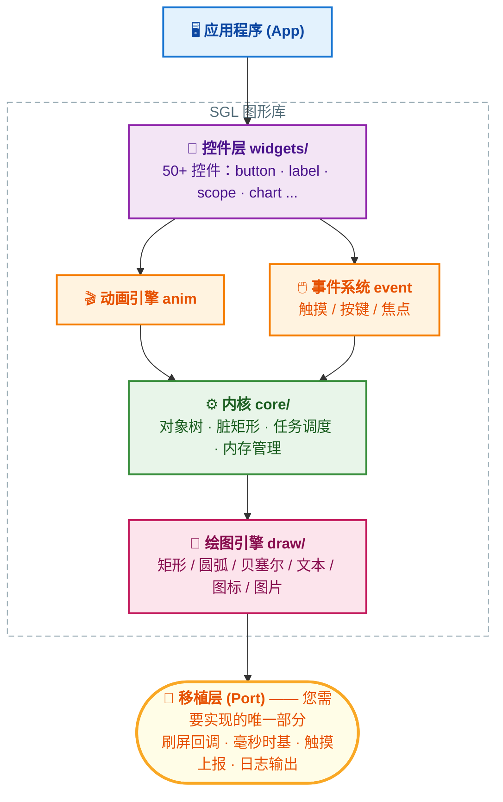
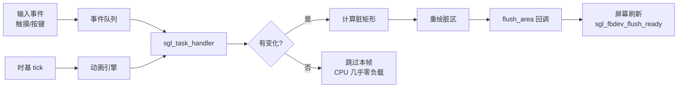

<div align="center">


# SGL —— Small Graphics Library

**专为 MCU 打造的轻量级、高性能 GUI 图形库**

[](LICENSE)
[](https://github.com/sgl-org/sgl/actions/workflows/ubuntu-gcc.yml)
[]()
[]()

[简介](#-项目简介) · [快速开始](#-快速开始) · [核心概念](#-核心概念) · [移植指南](#-移植指南) · [控件一览](#-控件一览) · [社区](#-社区与支持)

**中文 | [English](README_EN.md)**

</div>

---

## 📖 项目简介

SGL（Small Graphics Library）是一个用 **C99** 编写的轻量级图形库，专为 MCU 级处理器设计，
目标是让资源受限的嵌入式设备也能拥有**美观、流畅、现代化**的图形用户界面（GUI）。

它不依赖任何操作系统 —— 裸机、RTOS、Linux 上都可以运行，只需要您提供
**一块屏幕的刷新回调** 和 **一个毫秒时基**，其余的一切（渲染、脏矩形管理、事件分发、动画）
全部由 SGL 完成。

### ✨ 特性亮点

| | 特性 | 说明 |
|:-:|:---|:---|
| 🪶 | **极致轻量** | 最小仅需 `3KB RAM` + `15KB ROM` 即可运行 |
| 🧩 | **部分刷新** | 支持部分帧缓冲，最小只需一行屏幕分辨率的缓冲 |
| 🎯 | **脏矩形算法** | 包围盒 + 贪心算法合并脏区，只重绘变化区域 |
| ⚡ | **零拷贝直写** | 支持帧缓冲控制器直写，绕过软件缓冲 |
| 🎨 | **多色深支持** | `8bit (RGB332)` / `16bit (RGB565)` / `24bit (RGB888)` / `32bit (ARGB8888)` |
| 🔄 | **屏幕旋转** | 支持静态旋转 `0/90/180/270°` 与运行时动态旋转 |
| 🖱 | **完整事件系统** | 触摸点击、长按、滑动方向、物理按键、焦点管理 |
| 🎬 | **动画引擎** | 内置补间动画，支持多种缓动路径与循环模式 |
| 🌏 | **现代字体工具** | 支持压缩字体、外部 Flash 字库、中文 CJK |
| 🗂 | **文件系统对接** | FATFS / LittleFS / RAMFS 开箱即用 |
| 🧱 | **50+ 内置控件** | 从按钮、滑条到示波器、二维码、文件浏览器 |

### 📐 最低硬件要求

| Flash 大小 | RAM 大小 |
|:---------:|:--------:|
| 15 kB | 3 kB |

---

## 🏗 架构总览



一帧界面的完整工作流程：



### 📂 目录结构

```
sgl/
├── source/
│   ├── sgl.h               # 总头文件，包含所有模块
│   ├── sgl_config.h        # 功能裁剪配置（裁出最小体积的关键）
│   ├── core/               # 内核：对象树、脏矩形、任务调度、事件
│   ├── draw/               # 绘图引擎：矩形/圆/弧/贝塞尔/文本/图标
│   ├── widgets/            # 50+ 内置控件（每个控件独立目录）
│   ├── fonts/              # 内置字体（Consolas / 宋体 / 图标字体）
│   ├── fs/                 # 文件系统适配：fatfs / littlefs / ramfs
│   ├── mm/                 # 内存管理算法：lwmem / tlsf / mtlsf / umm_malloc
│   ├── components/         # 扩展组件：timer 等
│   ├── include/            # 公共头文件（sgl_core.h / sgl_event.h / ...）
│   └── examples/           # 每个控件的示例代码，学习 SGL 的最佳入口
├── demos/                  # 复合型演示（如 coverflow）
├── cmake/                  # CMake 配置模板
└── configure.md            # sgl_config.h 逐项配置说明
```

---

## 🚀 快速开始

最快的体验方式是在 Windows 上用 SDL2 模拟器运行，无需任何硬件。

### 方式一：VS Code + CMake（推荐，本仓库）

1. 安装 [VS Code](https://code.visualstudio.com/)、[CMake Tools 插件](https://marketplace.visualstudio.com/items?itemName=ms-vscode.cmake-tools) 与 [MinGW GCC](https://github.com/niXman/mingw-builds-binaries/releases)
2. 克隆本仓库并初始化子模块：

```bash
git clone https://github.com/sgl-org/sgl-port-windows-vscode.git
cd sgl-port-windows-vscode
git submodule init
git submodule update --remote
```

3. 用 VS Code 打开目录，将 `demo/sgl_config.h` 的内容覆盖到 `sgl/source/sgl_config.h`
4. 点击底部状态栏的 **Build**，选择 `sgl_simulator` 目标，编译完成后 **Run** 即可

> 💡 在 `demo/main.c` 中取消注释任意 `sgl_xxx_examples()` 即可切换不同控件示例，
> 所有示例源码都在 [`sgl/examples/`](examples/) 目录下，是最直观的 API 教材。

### 方式二：命令行 + Makefile

```bash
git clone https://github.com/sgl-org/sgl-port-windows.git
cd sgl-port-windows
git submodule init
git submodule update --remote
cd demo
make -j8      # 编译
make run      # 运行
```

---

## 🧠 核心概念

SGL 采用 **对象树 + 事件驱动 + 脏矩形** 的设计，写一个界面只需要三步：
**创建控件 → 设置属性 → 绑定事件回调**。

### Hello World

```c
#include "sgl.h"

/* 点击回调：每点一次，计数 +1 并刷新到 label 上 */
static void btn_clicked_cb(sgl_event_t *e)
{
    static uint32_t count = 0;
    sgl_obj_t *label = (sgl_obj_t *)e->event_data;   /* 绑定时携带的私有数据 */
    sgl_label_set_text_fmt(label, "clicked %d times", ++count);
}

void my_ui_create(void)
{
    /* 1. 创建控件（parent 为 NULL 表示放在当前屏幕上） */
    sgl_obj_t *btn   = sgl_button_create(NULL);
    sgl_obj_t *label = sgl_label_create(NULL);

    /* 2. 设置位置、尺寸与外观 */
    sgl_obj_set_pos(btn, 10, 10);
    sgl_obj_set_size(btn, 120, 40);
    sgl_button_set_text(btn, "Count me");
    sgl_button_set_font(btn, &consolas24);
    sgl_button_set_radius(btn, 8);                  /* 圆角 */
    sgl_button_set_color(btn, sgl_rgb(46, 139, 87));/* 自定义颜色 */

    sgl_obj_set_pos(label, 10, 60);
    sgl_obj_set_size(label, 200, 30);
    sgl_label_set_text(label, "clicked 0 times");
    sgl_label_set_text_color(label, SGL_COLOR_CYAN);

    /* 3. 绑定事件回调，label 作为私有数据透传给回调 */
    sgl_obj_set_event_cb(btn, btn_clicked_cb, label);
}
```

> 完整可运行版本见 [`examples/button.c`](examples/button.c)，每个控件都有对应的示例文件。

### 常用事件类型

| 事件宏 | 触发时机 | 事件宏 | 触发时机 |
|:---|:---|:---|:---|
| `SGL_EVENT_PRESSED` | 按下 | `SGL_EVENT_CLICKED` | 点击（按下并抬起） |
| `SGL_EVENT_RELEASED` | 抬起 | `SGL_EVENT_LONG_CLICKED` | 长按后抬起 |
| `SGL_EVENT_MOVE_UP/DOWN/LEFT/RIGHT` | 定向滑动 | `SGL_EVENT_FOCUSED` | 获得焦点（按键导航） |
| `SGL_EVENT_KEY_UP/DOWN/LEFT/RIGHT/ESC` | 物理按键 | `SGL_EVENT_DESTROYED` | 对象销毁 |

### 动画

```c
/* 动画驱动的是任意整数值，通过回调把插值反映到界面上 */
static void loader_anim_cb(sgl_anim_t *anim, int32_t value)
{
    /* value 从 0 插值到 360，这里更新控件属性 */
    sgl_arc_set_end_angle(g_loader, value);
}

void my_anim_create(void)
{
    sgl_anim_t *anim = sgl_anim_create();
    if (anim != NULL) {
        sgl_anim_set_data(anim, NULL);                 /* 携带私有数据（可选） */
        sgl_anim_set_start_value(anim, 0);
        sgl_anim_set_end_value(anim, 360);
        sgl_anim_set_act_duration(anim, 1800);         /* 时长 ms */
        sgl_anim_set_act_delay(anim, 300);             /* 起始延时 ms（可选） */
        sgl_anim_set_path(anim, loader_anim_cb, SGL_ANIM_PATH_EASE_OUT); /* 回调 + 缓动曲线 */
        sgl_anim_set_auto_free(anim);                  /* 结束后自动释放（可选） */
        sgl_anim_start(anim, SGL_ANIM_REPEAT_LOOP);    /* 循环播放；播放一次用 SGL_ANIM_REPEAT_ONCE */
    }
}
```

> 内置缓动曲线：`SGL_ANIM_PATH_LINEAR` / `EASE_IN` / `EASE_OUT` / `EASE_IN_OUT` / `EASE_OUT_BACK` / `EASE_IN_OUT_SINE` 等，
> 完整列表见 [`sgl_anim.h`](source/include/sgl_anim.h)，使用实例见 [`examples/arc.c`](examples/arc.c)。

---

## 🔌 移植指南

SGL 对平台的依赖被压缩到了极致，**只需实现 3 个必需接口**，即可在任何带屏幕的平台上运行。
下表是全部移植工作量：

| 接口 | 必需 | 作用 | 建议挂载位置 |
|:---|:---:|:---|:---|
| `flush_area` 刷屏回调 | ✅ | 把渲染缓冲送到屏幕 | LCD 驱动（SPI/QSPI/RGB/DMA） |
| `sgl_fbdev_flush_ready()` | ✅ | 通知 SGL 本块刷写完成 | 刷屏回调末尾或 DMA 完成中断 |
| `sgl_tick_inc(ms)` | ✅ | 提供 SGL 毫秒时基 | SysTick 中断 / 定时器 |
| `sgl_event_pos_input(x, y, pressed)` | ➖ | 上报触摸坐标与按下状态 | 触摸中断 / 轮询 |
| `sgl_logdev_register(puts)` | ➖ | 重定向 SGL 日志输出 | 串口 printf |

> ➖ 表示可选：没有触摸屏可以不上报输入，纯显示应用完全不受影响。

### 移植步骤

#### 第 1 步：准备显示缓冲

根据 RAM 预算选择缓冲策略。**双缓冲 + 多行** 是流畅度与内存的最佳平衡：

```c
#define PANEL_WIDTH     240
#define PANEL_HEIGHT    320
#define BUF_LINES       20        /* 每次渲染 20 行，占用 240*20*2 = 9.6KB */

static sgl_color_t buf0[PANEL_WIDTH * BUF_LINES];
static sgl_color_t buf1[PANEL_WIDTH * BUF_LINES];
```

> 💡 RAM 极度紧张时，可将 `BUF_LINES` 设为 `1`（仅 480 字节 @ 240 宽 RGB565）；
> 如果板载大 RAM 且希望极致性能，也可以直接用整帧缓冲配合 `CONFIG_SGL_USE_FBDEV_VRAM` 零拷贝直写。

#### 第 2 步：实现刷屏回调

这是唯一的硬件相关渲染函数 —— 收到脏区 `area` 后，把 `src` 中的像素写入屏幕对应窗口：

```c
static void my_flush_area(sgl_area_t *area, sgl_color_t *src)
{
    int16_t w = area->x2 - area->x1 + 1;
    int16_t h = area->y2 - area->y1 + 1;

    /* 示例：SPI 屏（如 ST7789/ILI9341），设置地址窗口后连续写像素 */
    lcd_set_address_window(area->x1, area->y1, area->x2, area->y2);
    lcd_write_pixels((const uint8_t *)src, (uint32_t)w * h * sizeof(sgl_color_t));

    /* 关键！告诉 SGL 数据已经送达，SGL 才会渲染下一块 */
    sgl_fbdev_flush_ready();
}
```

<details>
<summary>⚡ 进阶：DMA 异步刷屏（推荐，可大幅提高帧率）</summary>

```c
static void my_flush_area(sgl_area_t *area, sgl_color_t *src)
{
    lcd_set_address_window(area->x1, area->y1, area->x2, area->y2);
    lcd_dma_send_pixels(src, (area->x2 - area->x1 + 1) * (area->y2 - area->y1 + 1));
    /* 不在这里等待，回调立即返回，SGL 渲染下一块的同时 DMA 在搬运 */
}

/* DMA 传输完成中断中 */
void DMA_CH_IRQHandler(void)
{
    dma_clear_flag();
    sgl_fbdev_flush_ready();   /* 在中断里通知 SGL */
}
```

</details>

#### 第 3 步：注册设备并初始化

```c
void sgl_port_init(void)
{
    sgl_fbinfo_t fbinfo = {
        .xres        = PANEL_WIDTH,
        .yres        = PANEL_HEIGHT,
        .flush_area  = my_flush_area,
        .buffer[0]   = buf0,
        .buffer[1]   = buf1,
        .buffer_size = SGL_ARRAY_SIZE(buf0),   /* 单个缓冲的像素个数 */
    };

    sgl_fbdev_register(&fbinfo);      /* 1. 注册显示设备（必须在 sgl_init 之前） */

    sgl_logdev_register(my_log_puts); /* 2.（可选）注册日志输出到串口 */

    sgl_init();                       /* 3. 初始化 SGL：内存池/屏幕对象/事件队列 */
}
```

初始化完成后，SGL 内部使用 `CONFIG_SGL_HEAP_MEMORY_SIZE` 指定大小的**静态内存池**
管理所有控件对象 —— 无需 `malloc`，也避免了堆碎片风险。

#### 第 4 步：接入时基与输入

```c
/* SysTick 中断服务函数中（1ms 一次） */
void SysTick_Handler(void)
{
    sgl_tick_inc(1);
}

/* 触摸中断或轮询函数中 */
void my_touch_scan(void)
{
    int16_t x, y;
    bool pressed = touch_read(&x, &y);
    sgl_event_pos_input(x, y, pressed);   /* 按下/移动/抬起 都调这一个函数 */
}
```

#### 第 5 步：主循环

```c
int main(void)
{
    board_init();          /* 时钟、LCD、触摸等硬件初始化 */
    sgl_port_init();       /* 注册设备 + sgl_init() */

    my_ui_create();        /* 构建 UI（见上一节 Hello World） */

    while (1) {
        sgl_task_handler();        /* 事件分发 + 动画推进 + 脏区重绘 */
        my_touch_scan();           /* 触摸轮询（中断方式可省略） */
    }
}
```

> `sgl_task_handler()` 内部自带节流：未到 `CONFIG_SGL_SYSTICK_MS` 周期或界面无变化时直接返回，
> 所以放心放在 `while(1)` 里调用即可。RTOS 用户也可以把它放进独立 GUI 线程。

#### 第 6 步：裁剪配置

编辑 `sgl/source/sgl_config.h`，关键配置项：

| 配置项 | 说明 | 建议 |
|:---|:---|:---|
| `CONFIG_SGL_FBDEV_PIXEL_DEPTH` | 色深 `8/16/24/32` | 与屏幕一致，常见为 `16` |
| `CONFIG_SGL_FBDEV_ROTATION` | 静态旋转 `0/90/180/270` | 横屏改竖屏时使用 |
| `CONFIG_SGL_COLOR16_SWAP` | RGB565 字节序交换 | SPI 大端屏颜色异常时置 `1` |
| `CONFIG_SGL_HEAP_MEMORY_SIZE` | GUI 堆大小（字节） | 按控件数量调整 |
| `CONFIG_SGL_FONT_XXX` | 内置字体开关 | **只开用到的**，字体是 Flash 大户 |
| `CONFIG_SGL_DEBUG` | 调试日志 | 量产时关闭 |

完整的逐项说明请阅读 **[configure.md](configure.md)**。

#### 第 7 步：接入构建系统

将以下源文件加入工程编译（CMake / Makefile / Keil / IAR / CubeIDE 均可）：

```text
sgl/source/core/*.c        # 内核
sgl/source/draw/*.c        # 绘图引擎
sgl/source/mm/<算法>/*.c    # 内存管理，如 mm/lwmem/
sgl/source/fonts/<启用>.c   # 仅加入启用的字体
sgl/source/widgets/...     # 仅加入用到的控件
```

并添加头文件搜索路径：`sgl/source/` 与 `sgl/source/include/`。

<details>
<summary>📋 移植核对清单（Checklist）</summary>

- [ ] LCD 驱动能完成「设置地址窗口 + 连续写像素」
- [ ] 实现并注册了 `flush_area` 回调，回调内（或 DMA 完成中断里）调用了 `sgl_fbdev_flush_ready()`
- [ ] `sgl_tick_inc()` 已挂到毫秒时基（动画与长按检测依赖它）
- [ ] `sgl_event_pos_input()` 已接入触摸（可选）
- [ ] `sgl_fbdev_register()` 在 `sgl_init()` **之前**调用
- [ ] `sgl_config.h` 的色深与屏幕一致，SPI 屏检查字节序
- [ ] 控件创建于 `sgl_init()` 之后

</details>

### 移植常见问题

<details>
<summary>❓ 屏幕颜色不对（红蓝互换/偏色）</summary>

16bit SPI 屏通常是字节序问题，将 `CONFIG_SGL_COLOR16_SWAP` 置 `1`。

</details>

<details>
<summary>❓ 界面完全不动 / 无任何显示</summary>

按顺序检查：① `sgl_fbdev_register` 是否在 `sgl_init` 之前调用；② `flush_area` 是否漏调 `sgl_fbdev_flush_ready()`（DMA 模式应在传输完成中断里调用）；③ `sgl_task_handler()` 是否在主循环中调用；④ 打开 `CONFIG_SGL_DEBUG` 观察日志。

</details>

<details>
<summary>❓ 长按检测、动画速度不准</summary>

`sgl_tick_inc(ms)` 的入参必须与实际调用周期一致（如 1ms SysTick 传 `1`）。

</details>

---

## 🧱 控件一览

全部控件位于 [`source/widgets/`](source/widgets/)，已由 `sgl.h` 统一引入，均附示例源码：

| 基础控件 | 进阶控件 | 数据可视化 | 复合/高级 |
|:---|:---|:---|:---|
| `label` 文本 | `img` / `img_ext` 图片 | `scope` 示波器 | `launcher` 启动器 |
| `button` 按钮 | `msgbox` 消息框 | `chart` 图表 | `menu` 菜单 |
| `checkbox` 复选框 | `win` 窗口 | `curve` 曲线 | `tabview` 标签页 |
| `switch` 开关 | `keyboard` 键盘 | `spectrum` 频谱 | `coverflow` 3D 流转 |
| `slider` 滑条 | `textedit` 文本编辑 | `gauge` 仪表盘 | `scrollview` 滚动视图 |
| `progress` 进度条 | `textlist` 文本列表 | `bar` 条形图 | `filebrowser` 文件浏览 |
| `dropdown` 下拉框 | `viewlist` 视图列表 | `battery` 电池 | `analogclock` 模拟时钟 |
| `roller` 滚轮 | `qrcode` 二维码 | `arc` / `ring` 圆弧环 | `sprite` 精灵动画 |
| `stepper` 步进器 | `canvas` 画布 | `led` LED | `3dvortex` 3D 特效 |
| `rect` / `circle` 图形 | `icon` 图标 | `polygon` 多边形 | `statusbar` 状态栏 |

> 每个控件都有对应示例，见 [`sgl/examples/`](examples/)，配合 SDL2 模拟器边改边看效果。

---

## 🛠 配套工具

| 工具 | 位置 | 说明 |
|:---|:---|:---|
| 字体取模工具 | [sgl_font_conv_cli](../sgl_font_conv_cli/) | 基于 FreeType，将 TTF/OTF 转为 SGL 字体，支持 RLE 压缩与中文字符集 |
| 图片转换工具 | [sgl_image_conv_cli](../sgl_image_conv_cli/) | 将 PNG/JPG 转为 SGL pixmap，支持压缩 |
| UI 设计器 | SGL UI Designer | 图形化拖拽设计界面，一键生成代码 |
| Windows 模拟器 | 本仓库 | PC 上零硬件成本开发调试 GUI |

---

## 🤝 如何贡献

欢迎提交 Issue 与 Pull Request！贡献代码请遵循项目现有的代码风格（注释格式、命名约定），
新增控件请同步在 [`examples/`](examples/) 中提供示例。

## 📄 许可证

SGL 基于 [MIT License](LICENSE) 开源，可免费用于商业项目。

---

## 📮 社区与支持

<div align="center">

| 💬 社区论坛 | 👥 QQ 交流群 |
|:---:|:---:|
| [sgl.openbfdev.com](https://sgl.openbfdev.com) | **544602724** |

**如果 SGL 对您的项目有帮助，欢迎点亮一个 ⭐ Star！**

</div>
