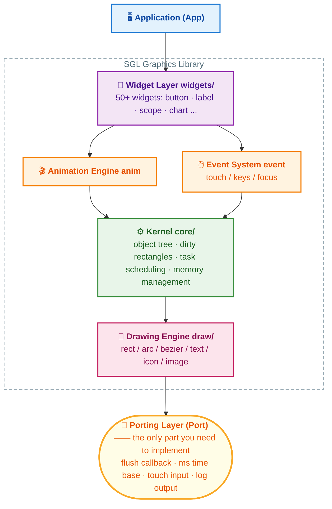
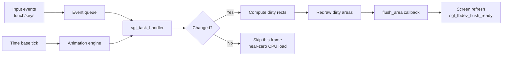

<div align="center">


# SGL —— Small Graphics Library

**A lightweight, high-performance GUI library built for MCUs**

[](LICENSE)
[](https://github.com/sgl-org/sgl/actions/workflows/ubuntu-gcc.yml)
[]()
[]()

[Introduction](#-introduction) · [Quick Start](#-quick-start) · [Core Concepts](#-core-concepts) · [Porting Guide](#-porting-guide) · [Widgets](#-widget-overview) · [Community](#-community--support)

**English | [中文](README.md)**

</div>

---

## 📖 Introduction

SGL (Small Graphics Library) is a lightweight graphics library written in **C99**, designed
specifically for MCU-class processors. Its goal is to bring **beautiful, smooth and modern**
graphical user interfaces (GUI) to resource-constrained embedded devices.

It does not depend on any operating system — it runs on bare metal, RTOS or Linux alike.
You only need to provide **a screen flush callback** and **a millisecond time base**;
everything else (rendering, dirty-rectangle management, event dispatching, animation)
is handled entirely by SGL.

### ✨ Feature Highlights

| | Feature | Description |
|:-:|:---|:---|
| 🪶 | **Ultra Lightweight** | Runs with as little as `3KB RAM` + `15KB ROM` |
| 🧩 | **Partial Refresh** | Partial frame buffer support; a one-line-resolution buffer is enough at minimum |
| 🎯 | **Dirty Rectangle Algorithm** | Bounding box + greedy merging of dirty areas; only changed regions get redrawn |
| ⚡ | **Zero-Copy Direct Write** | Writes directly to the frame buffer controller, bypassing software buffers |
| 🎨 | **Multiple Color Depths** | `8bit (RGB332)` / `16bit (RGB565)` / `24bit (RGB888)` / `32bit (ARGB8888)` |
| 🔄 | **Screen Rotation** | Static rotation `0/90/180/270°` plus runtime dynamic rotation |
| 🖱 | **Complete Event System** | Touch clicks, long press, swipe direction, physical keys, focus management |
| 🎬 | **Animation Engine** | Built-in tween animations with various easing paths and repeat modes |
| 🌏 | **Modern Font Tooling** | Compressed fonts, external Flash font libraries, CJK support |
| 🗂 | **File System Support** | FATFS / LittleFS / RAMFS out of the box |
| 🧱 | **50+ Built-in Widgets** | From buttons and sliders to oscilloscopes, QR codes and file browsers |

### 📐 Minimum Hardware Requirements

| Flash Size | RAM Size |
|:---------:|:--------:|
| 15 kB | 3 kB |

---

## 🏗 Architecture Overview



The complete workflow of rendering one frame:



### 📂 Directory Structure

```
sgl/
├── source/
│   ├── sgl.h               # Umbrella header, includes all modules
│   ├── sgl_config.h        # Feature trimming config (the key to a minimal footprint)
│   ├── core/               # Kernel: object tree, dirty rects, task scheduling, events
│   ├── draw/               # Drawing engine: rect/circle/arc/bezier/text/icon
│   ├── widgets/            # 50+ built-in widgets (one directory per widget)
│   ├── fonts/              # Built-in fonts (Consolas / Song / icon font)
│   ├── fs/                 # File system adapters: fatfs / littlefs / ramfs
│   ├── mm/                 # Memory algorithms: lwmem / tlsf / mtlsf / umm_malloc
│   ├── components/         # Extensions: timer, etc.
│   ├── include/            # Public headers (sgl_core.h / sgl_event.h / ...)
│   └── examples/           # Example code for every widget — the best way to learn SGL
├── cmake/                  # CMake config templates
└── configure.md            # Item-by-item sgl_config.h reference
```

---

## 🚀 Quick Start

The fastest way to experience SGL is running the SDL2 simulator on Windows — no hardware required.

### Option 1: VS Code + CMake (recommended, this repository)

1. Install [VS Code](https://code.visualstudio.com/), the [CMake Tools extension](https://marketplace.visualstudio.com/items?itemName=ms-vscode.cmake-tools) and [MinGW GCC](https://github.com/niXman/mingw-builds-binaries/releases)
2. Clone this repository and initialize the submodules:

```bash
git clone https://github.com/sgl-org/sgl-port-windows-vscode.git
cd sgl-port-windows-vscode
git submodule init
git submodule update --remote
```

3. Open the folder in VS Code, then copy the content of `demo/sgl_config.h` over `sgl/source/sgl_config.h`
4. Click **Build** in the bottom status bar, pick the `sgl_simulator` target, then hit **Run**

> 💡 Uncomment any `sgl_xxx_examples()` in `demo/main.c` to switch between widget demos.
> All example sources live in [`sgl/examples/`](examples/) — the most intuitive API handbook.

### Option 2: Command Line + Makefile

```bash
git clone https://github.com/sgl-org/sgl-port-windows.git
cd sgl-port-windows
git submodule init
git submodule update --remote
cd demo
make -j8      # build
make run      # run
```

---

## 🧠 Core Concepts

SGL is built around an **object tree + event-driven + dirty rectangle** design.
Building a UI takes just three steps: **create widgets → set properties → attach event callbacks**.

### Hello World

```c
#include "sgl.h"

/* Click callback: increment a counter and refresh the label each click */
static void btn_clicked_cb(sgl_event_t *e)
{
    static uint32_t count = 0;
    sgl_obj_t *label = (sgl_obj_t *)e->event_data;   /* private data passed at bind time */
    sgl_label_set_text_fmt(label, "clicked %d times", ++count);
}

void my_ui_create(void)
{
    /* 1. Create widgets (parent = NULL means the active screen) */
    sgl_obj_t *btn   = sgl_button_create(NULL);
    sgl_obj_t *label = sgl_label_create(NULL);

    /* 2. Set position, size and appearance */
    sgl_obj_set_pos(btn, 10, 10);
    sgl_obj_set_size(btn, 120, 40);
    sgl_button_set_text(btn, "Count me");
    sgl_button_set_font(btn, &consolas24);
    sgl_button_set_radius(btn, 8);                  /* rounded corners */
    sgl_button_set_color(btn, sgl_rgb(46, 139, 87));/* custom color */

    sgl_obj_set_pos(label, 10, 60);
    sgl_obj_set_size(label, 200, 30);
    sgl_label_set_text(label, "clicked 0 times");
    sgl_label_set_text_color(label, SGL_COLOR_CYAN);

    /* 3. Attach the event callback; label is passed through as private data */
    sgl_obj_set_event_cb(btn, btn_clicked_cb, label);
}
```

> A complete runnable version is in [`examples/button.c`](examples/button.c);
> every widget ships with its own example file.

### Common Event Types

| Event Macro | Trigger | Event Macro | Trigger |
|:---|:---|:---|:---|
| `SGL_EVENT_PRESSED` | pressed | `SGL_EVENT_CLICKED` | clicked (pressed then released) |
| `SGL_EVENT_RELEASED` | released | `SGL_EVENT_LONG_CLICKED` | released after long press |
| `SGL_EVENT_MOVE_UP/DOWN/LEFT/RIGHT` | directional swipe | `SGL_EVENT_FOCUSED` | focus gained (key navigation) |
| `SGL_EVENT_KEY_UP/DOWN/LEFT/RIGHT/ESC` | physical keys | `SGL_EVENT_DESTROYED` | object destroyed |

### Animation

```c
/* Animations drive any integer value; reflect the interpolated value in the UI via callback */
static void loader_anim_cb(sgl_anim_t *anim, int32_t value)
{
    /* value is interpolated from 0 to 360; update widget properties here */
    sgl_arc_set_end_angle(g_loader, value);
}

void my_anim_create(void)
{
    sgl_anim_t *anim = sgl_anim_create();
    if (anim != NULL) {
        sgl_anim_set_data(anim, NULL);                 /* carry private data (optional) */
        sgl_anim_set_start_value(anim, 0);
        sgl_anim_set_end_value(anim, 360);
        sgl_anim_set_act_duration(anim, 1800);         /* duration in ms */
        sgl_anim_set_act_delay(anim, 300);             /* start delay in ms (optional) */
        sgl_anim_set_path(anim, loader_anim_cb, SGL_ANIM_PATH_EASE_OUT); /* callback + easing curve */
        sgl_anim_set_auto_free(anim);                  /* auto free when done (optional) */
        sgl_anim_start(anim, SGL_ANIM_REPEAT_LOOP);    /* loop; use SGL_ANIM_REPEAT_ONCE to play once */
    }
}
```

> Built-in easing curves: `SGL_ANIM_PATH_LINEAR` / `EASE_IN` / `EASE_OUT` / `EASE_IN_OUT` / `EASE_OUT_BACK` / `EASE_IN_OUT_SINE` and more.
> See [`sgl_anim.h`](source/include/sgl_anim.h) for the full list and [`examples/arc.c`](examples/arc.c) for live usage.

---

## 🔌 Porting Guide

SGL keeps platform dependencies down to the bare minimum: **just 3 mandatory interfaces**
and it runs on any platform with a screen. The table below is the entire porting workload:

| Interface | Required | Purpose | Suggested Hook Point |
|:---|:---:|:---|:---|
| `flush_area` flush callback | ✅ | Push the render buffer to the screen | LCD driver (SPI/QSPI/RGB/DMA) |
| `sgl_fbdev_flush_ready()` | ✅ | Tell SGL the current block has been flushed | End of the flush callback or DMA transfer-complete IRQ |
| `sgl_tick_inc(ms)` | ✅ | Provide SGL a millisecond time base | SysTick interrupt / timer |
| `sgl_event_pos_input(x, y, pressed)` | ➖ | Report touch coordinates and press state | Touch IRQ / polling |
| `sgl_logdev_register(puts)` | ➖ | Redirect SGL log output | UART printf |

> ➖ means optional: a display-only application works perfectly without any touch input.

### Porting Steps

#### Step 1: Prepare the Display Buffers

Choose a buffer strategy based on your RAM budget. **Double buffering + multiple lines**
is the best balance between smoothness and memory:

```c
#define PANEL_WIDTH     240
#define PANEL_HEIGHT    320
#define BUF_LINES       20        /* render 20 lines at a time: 240*20*2 = 9.6KB */

static sgl_color_t buf0[PANEL_WIDTH * BUF_LINES];
static sgl_color_t buf1[PANEL_WIDTH * BUF_LINES];
```

> 💡 Under tight RAM, set `BUF_LINES` to `1` (just 480 bytes at 240-wide RGB565);
> with plenty of RAM and a need for maximum performance, use a full-frame buffer
> together with `CONFIG_SGL_USE_FBDEV_VRAM` for zero-copy direct writes.

#### Step 2: Implement the Flush Callback

This is the only hardware-related rendering function — upon receiving a dirty area `area`,
write the pixels in `src` into the corresponding screen window:

```c
static void my_flush_area(sgl_area_t *area, sgl_color_t *src)
{
    int16_t w = area->x2 - area->x1 + 1;
    int16_t h = area->y2 - area->y1 + 1;

    /* Example: SPI display (e.g. ST7789/ILI9341) — set the address window, then stream pixels */
    lcd_set_address_window(area->x1, area->y1, area->x2, area->y2);
    lcd_write_pixels((const uint8_t *)src, (uint32_t)w * h * sizeof(sgl_color_t));

    /* Critical! Tell SGL the data has been delivered so it can render the next block */
    sgl_fbdev_flush_ready();
}
```

<details>
<summary>⚡ Advanced: asynchronous DMA flush (recommended, greatly improves frame rate)</summary>

```c
static void my_flush_area(sgl_area_t *area, sgl_color_t *src)
{
    lcd_set_address_window(area->x1, area->y1, area->x2, area->y2);
    lcd_dma_send_pixels(src, (area->x2 - area->x1 + 1) * (area->y2 - area->y1 + 1));
    /* Do not wait here — return immediately so SGL renders the next block while DMA transfers */
}

/* In the DMA transfer-complete interrupt */
void DMA_CH_IRQHandler(void)
{
    dma_clear_flag();
    sgl_fbdev_flush_ready();   /* notify SGL from the interrupt */
}
```

</details>

#### Step 3: Register Devices and Initialize

```c
void sgl_port_init(void)
{
    sgl_fbinfo_t fbinfo = {
        .xres        = PANEL_WIDTH,
        .yres        = PANEL_HEIGHT,
        .flush_area  = my_flush_area,
        .buffer[0]   = buf0,
        .buffer[1]   = buf1,
        .buffer_size = SGL_ARRAY_SIZE(buf0),   /* pixel count of a single buffer */
    };

    sgl_fbdev_register(&fbinfo);      /* 1. Register the display device (must precede sgl_init) */

    sgl_logdev_register(my_log_puts); /* 2. (optional) Route log output to UART */

    sgl_init();                       /* 3. Initialize SGL: memory pool / screen object / event queue */
}
```

After initialization, SGL manages all widget objects internally with a **static memory pool**
sized by `CONFIG_SGL_HEAP_MEMORY_SIZE` — no `malloc` needed and no heap fragmentation risk.

#### Step 4: Hook Up the Time Base and Input

```c
/* Inside the SysTick interrupt handler (1ms interval) */
void SysTick_Handler(void)
{
    sgl_tick_inc(1);
}

/* Inside a touch interrupt or polling function */
void my_touch_scan(void)
{
    int16_t x, y;
    bool pressed = touch_read(&x, &y);
    sgl_event_pos_input(x, y, pressed);   /* press/move/release all use this one call */
}
```

#### Step 5: Main Loop

```c
int main(void)
{
    board_init();          /* clocks, LCD, touch and other hardware init */
    sgl_port_init();       /* register devices + sgl_init() */

    my_ui_create();        /* build the UI (see Hello World above) */

    while (1) {
        sgl_task_handler();        /* event dispatch + animation + dirty-area redraw */
        my_touch_scan();           /* touch polling (omit when using interrupts) */
    }
}
```

> `sgl_task_handler()` throttles itself: it returns immediately before the
> `CONFIG_SGL_SYSTICK_MS` period elapses or when nothing changed, so it is safe to call
> in a `while(1)` loop. RTOS users may also run it in a dedicated GUI thread.

#### Step 6: Trim the Configuration

Edit `sgl/source/sgl_config.h`; key options:

| Option | Description | Recommendation |
|:---|:---|:---|
| `CONFIG_SGL_FBDEV_PIXEL_DEPTH` | Color depth `8/16/24/32` | Match your panel; usually `16` |
| `CONFIG_SGL_FBDEV_ROTATION` | Static rotation `0/90/180/270` | Use when swapping landscape/portrait |
| `CONFIG_SGL_COLOR16_SWAP` | Swap RGB565 byte order | Set to `1` if SPI big-endian panels show wrong colors |
| `CONFIG_SGL_HEAP_MEMORY_SIZE` | GUI heap size (bytes) | Tune according to widget count |
| `CONFIG_SGL_FONT_XXX` | Built-in font switches | **Enable only what you use**; fonts are Flash hogs |
| `CONFIG_SGL_DEBUG` | Debug logging | Turn off for production |

For the complete item-by-item reference, read **[configure.md](configure.md)**.

#### Step 7: Wire Up the Build System

Add the following sources to your build (CMake / Makefile / Keil / IAR / CubeIDE all work):

```text
sgl/source/core/*.c        # kernel
sgl/source/draw/*.c        # drawing engine
sgl/source/mm/<algo>/*.c   # memory management, e.g. mm/lwmem/
sgl/source/fonts/<enabled>.c  # only the fonts you enabled
sgl/source/widgets/...     # only the widgets you use
```

And add the header search paths: `sgl/source/` and `sgl/source/include/`.

<details>
<summary>📋 Porting Checklist</summary>

- [ ] The LCD driver can do "set address window + stream pixels"
- [ ] The `flush_area` callback is implemented and registered, and calls `sgl_fbdev_flush_ready()` (in the callback or the DMA-complete IRQ)
- [ ] `sgl_tick_inc()` is hooked to a millisecond time base (animation and long-press depend on it)
- [ ] `sgl_event_pos_input()` is wired to the touch device (optional)
- [ ] `sgl_fbdev_register()` is called **before** `sgl_init()`
- [ ] The color depth in `sgl_config.h` matches the panel; check byte order on SPI panels
- [ ] Widgets are created after `sgl_init()`

</details>

### Porting FAQ

<details>
<summary>❓ Wrong colors on screen (red/blue swapped or tinted)</summary>

16bit SPI panels usually have a byte-order issue — set `CONFIG_SGL_COLOR16_SWAP` to `1`.

</details>

<details>
<summary>❓ UI frozen / nothing displayed at all</summary>

Check in order: ① is `sgl_fbdev_register` called before `sgl_init`; ② is `sgl_fbdev_flush_ready()` missing from the flush callback (with DMA it belongs in the transfer-complete IRQ); ③ is `sgl_task_handler()` called in the main loop; ④ enable `CONFIG_SGL_DEBUG` and watch the logs.

</details>

<details>
<summary>❓ Long-press detection or animation speed is inaccurate</summary>

The argument of `sgl_tick_inc(ms)` must match the actual call interval (e.g. pass `1` for a 1ms SysTick).

</details>

---

## 🧱 Widget Overview

All widgets live in [`source/widgets/`](source/widgets/), are pulled in by `sgl.h`,
and each ships with example source:

| Basic | Intermediate | Data Visualization | Composite/Advanced |
|:---|:---|:---|:---|
| `label` text | `img` / `img_ext` image | `scope` oscilloscope | `launcher` launcher |
| `button` button | `msgbox` message box | `chart` chart | `menu` menu |
| `checkbox` checkbox | `win` window | `curve` curve | `tabview` tab view |
| `switch` switch | `keyboard` keyboard | `spectrum` spectrum | `coverflow` 3D cover flow |
| `slider` slider | `textedit` text editor | `gauge` gauge | `scrollview` scroll view |
| `progress` progress bar | `textlist` text list | `bar` bar chart | `filebrowser` file browser |
| `dropdown` dropdown | `viewlist` view list | `battery` battery | `analogclock` analog clock |
| `roller` roller | `qrcode` QR code | `arc` / `ring` arc & ring | `sprite` sprite animation |
| `stepper` stepper | `canvas` canvas | `led` LED | `3dvortex` 3D effects |
| `rect` / `circle` shapes | `icon` icon | `polygon` polygon | `statusbar` status bar |

> Every widget has a matching example in [`sgl/examples/`](examples/) —
> tweak and preview instantly with the SDL2 simulator.

---

## 🛠 Companion Tools

| Tool | Location | Description |
|:---|:---|:---|
| Font converter | [sgl_font_conv_cli](../sgl_font_conv_cli/) | FreeType-based; converts TTF/OTF into SGL fonts with RLE compression and Chinese charset support |
| Image converter | [sgl_image_conv_cli](../sgl_image_conv_cli/) | Converts PNG/JPG into SGL pixmaps with compression support |
| UI designer | SGL UI Designer | Drag-and-drop GUI design with one-click code generation |
| Windows simulator | This repository | Zero-hardware GUI development and debugging on PC |

---

## 🤝 Contributing

Issues and Pull Requests are welcome! Please follow the existing code style
(comment format, naming conventions) and add a matching example in
[`examples/`](examples/) for any new widget.

## 📄 License

SGL is open source under the [MIT License](LICENSE) and free for commercial use.

---

## 📮 Community & Support

<div align="center">

| 💬 Forum | 👥 QQ Group |
|:---:|:---:|
| [sgl.openbfdev.com](https://sgl.openbfdev.com) | **544602724** |

**If SGL helps your project, please give it a ⭐ Star!**

</div>
