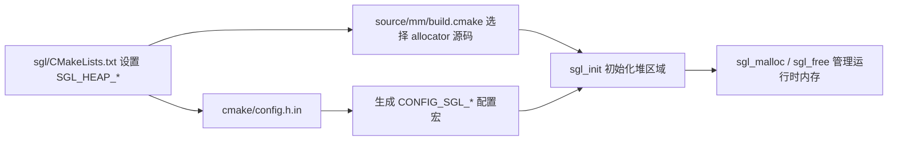

# SGL 内存管理配置指南

> **堆配置，一页读懂**  
> 当前版本通过顶层 `CMakeLists.txt` 中的 `SGL_HEAP_ALGO` 与 `SGL_HEAP_MEMORY_SIZE` 选择 allocator 和堆大小，再由 `source/mm/build.cmake` 加入对应实现。本文说明如何在 CMake 工程中选择并验证内存分配器。

## 目录

- [SGL 内存管理配置指南](#sgl-内存管理配置指南)
  - [目录](#目录)
  - [配置速览](#配置速览)
  - [配置生效链路](#配置生效链路)
  - [配置项详解](#配置项详解)
    - [`SGL_HEAP_ALGO`](#sgl_heap_algo)
    - [`CONFIG_SGL_TLSF_INDEX_MAX`（仅 TLSF）](#config_sgl_tlsf_index_max仅-tlsf)
    - [`SGL_HEAP_MEMORY_SIZE`](#sgl_heap_memory_size)
  - [allocator 选型](#allocator-选型)
    - [allocator 源码映射](#allocator-源码映射)
  - [TLSF 索引配置](#tlsf-索引配置)
  - [堆大小估算](#堆大小估算)
  - [构建接入](#构建接入)
  - [配置示例](#配置示例)
    - [CMake 中的嵌入式通用配置](#cmake-中的嵌入式通用配置)
    - [生成的 C 配置头示例](#生成的-c-配置头示例)
  - [常见问题](#常见问题)

## 配置速览

| CMake 设置项 | 生成宏 / 配置位置 | 当前默认值 |
|---|---|---:|
| `SGL_HEAP_ALGO` | `CONFIG_SGL_HEAP_ALGO` | `lwmem` |
| `SGL_HEAP_MEMORY_SIZE` | `CONFIG_SGL_HEAP_MEMORY_SIZE` | `10240` B |
| TLSF 专用：`CONFIG_SGL_TLSF_INDEX_MAX` | 当前 CMake 未提供对应变量，需显式定义 | fallback `13`（仅 heap-size 宏未定义时） |

堆用于 SGL 运行时动态对象和缓冲区，例如 widget、AVI 帧缓存、JPEG 解码工作区、索引表等。配置值表示**交给 allocator 管理的内存区域总大小**，并不代表应用可以完整使用每一个字节：allocator 元数据、对齐、碎片和仍存活的对象都会占用空间。

## 配置生效链路



当前工程的实际配置入口是 `sgl/CMakeLists.txt` 中的 `SGL_HEAP_ALGO` 与 `SGL_HEAP_MEMORY_SIZE`。它们被 `cmake/config.h.in` 写入生成配置头，同时 `source/mm/build.cmake` 按算法选择源文件。排查配置是否生效时，应同时检查：

- 当前构建真正使用的项目/CMake 配置。
- 生成或实际包含的 `sgl_config.h` 中的 `CONFIG_SGL_*` 值。
- allocator 对应的 `.c` 文件是否已加入当前目标。

## 配置项详解

### `SGL_HEAP_ALGO`

在 `sgl/CMakeLists.txt` 中设置 allocator 名称。当前代码默认值为 `lwmem`，可选值由 `source/mm/build.cmake` 的条件分支决定：

```text
set(SGL_HEAP_ALGO lwmem)
```

该选项选择为 SGL 提供内存管理实现的后端。不同后端的分配策略、元数据开销、碎片行为、多内存池支持和编译源文件都不同。不能只改宏而不把对应实现加入构建。

### `CONFIG_SGL_TLSF_INDEX_MAX`（仅 TLSF）

该值控制 TLSF 空闲链表的一级索引范围。当前 CMake 生成模板 `cmake/config.h.in` 没有导出 TLSF 索引变量；`source/include/sgl_cfgfix.h` 中的 fallback 默认值为 `13`，但它位于 heap-size fallback 条件内。使用 TLSF 前，应在实际配置头中显式定义该宏，并确认数值与堆大小及 TLSF 实现匹配：

```c
#define CONFIG_SGL_TLSF_INDEX_MAX 13
```

索引范围需要覆盖配置堆可能出现的最大块；设置不匹配可能限制可管理块大小，或导致编译、初始化或分配失败。`configure.md` 中的索引建议可作为起点，最终应以当前 TLSF 实现要求为准。

### `SGL_HEAP_MEMORY_SIZE`

在 `sgl/CMakeLists.txt` 中设置堆区域大小，单位为字节；当前 CMake 默认值为 `10240`：

```cmake
set(SGL_HEAP_MEMORY_SIZE 262144)
```

配置 allocator 管理的内存大小，**单位是字节**：

| 配置值 | 换算参考 |
|---:|---:|
| `10240` | 10 KiB |
| `65536` | 64 KiB |
| `262144` | 256 KiB |
| `1024000` | 1000 KiB，约 0.98 MiB |
| `1048576` | 1 MiB |

按峰值同时存活的分配量估算，而不是按程序运行期间所有分配量累加。要考虑屏幕对象、控件、图片/视频帧、解码器工作区、索引表和临时缓冲，并给对齐和碎片留余量。

## allocator 选型

| allocator | 本仓库中的特点 | 适用场景 / 注意事项 |
|---|---|---|
| `lwmem` | 轻量、面向嵌入式，当前默认；SGL 适配层支持 `sgl_mm_add_pool()`。 | 通用 MCU 场景，希望降低 RAM/ROM 开销时优先考虑。 |
| `tlsf` | Two-Level Segregated Fit；上游实现支持多个 pool，分配行为面向实时场景并关注碎片控制；需要设置合适的 TLSF 索引上限。 | 需要可预测分配行为，或需要额外 pool 的项目。 |
| `mtlsf` | TLSF 风格 allocator；索引范围由 `CONFIG_SGL_HEAP_MEMORY_SIZE` 自动推导；本实现定义 pool 最小为 2048 B，初始化后不支持增加 pool。 | 只有一个连续 heap 区域，希望省去手动设置 TLSF 索引时。 |
| `umm_malloc` | 嵌入式 allocator；上游实现提供 fit 策略和诊断能力。SGL 适配层初始化一个 heap，`sgl_mm_add_pool()` 会警告并忽略额外 pool。 | 需要其诊断能力且使用单个初始化 heap 的项目。 |
| `other` | 当前提供的是弱实现，直接转发到 C 库 `malloc/realloc/free`；`CONFIG_SGL_HEAP_MEMORY_SIZE` 不会限制这些 C 库分配。 | 桌面原型或项目自行提供强符号覆盖时。 |

### allocator 源码映射

`source/mm/build.cmake` 根据 `SGL_HEAP_ALGO` 添加对应源文件：

| 配置值 | 加入构建的源文件 |
|---|---|
| `tlsf` | `tlsf/tlsf.c`、`tlsf/sgl_mm.c` |
| `mtlsf` | `mtlsf/mtlsf.c`、`mtlsf/sgl_mm.c` |
| `lwmem` | `lwmem/lwmem.c`、`lwmem/sgl_mm.c` |
| `other` | `other/sgl_mm.c` |
| `umm_malloc` | allocator 核心、info/integrity/poison 模块和 `umm_malloc/sgl_mm.c` |

## TLSF 索引配置

TLSF 索引可按堆大小估算：堆大小每翻倍，索引最大值加 1。

| 堆大小 | 建议 `CONFIG_SGL_TLSF_INDEX_MAX` |
|---:|---:|
| 1 KiB | 10 |
| 2 KiB | 11 |
| 4 KiB | 12 |
| 8 KiB | 13 |
| 16 KiB | 14 |

配置范围通常为 10 到 31。该表只是估算起点；还应核对所选 TLSF 实现、目标堆上限以及最终实际编译使用的配置宏。

## 堆大小估算

建议按峰值并发占用估算：

```text
堆大小 >= 峰值同时存活的应用分配
       + allocator 元数据与对齐开销
       + 碎片及临时分配余量
```

以 AVI 播放页面为例，峰值可能包括：

```text
AVI widget、路径和索引表
+ RGB565 解码帧（2 * 解码宽度 * 解码高度）
+ 视频 staging buffer
+ JPEG 解码工作区
+ PCM ring
+ 其他同时显示的控件
```

320×240 RGB565 单帧需要 153,600 B（150 KiB）。再加上 16 KiB PCM ring、18 KiB staging buffer 和 20 KiB JPEG 工作区，基础小计约 204 KiB；这还没有计入索引、对象、allocator 开销及同屏 UI。必须按目标设备实际峰值验证。

可在支持的 allocator 上通过 `sgl_mm_get_monitor()` 观察总量、已用量和剩余量；应同时测试典型界面、最复杂界面、视频播放和分配失败路径。

## 构建接入

本仓库的 `sgl/CMakeLists.txt` 直接设置 `SGL_HEAP_ALGO` 和 `SGL_HEAP_MEMORY_SIZE`，由 `cmake/config.h.in` 生成配置头中的 `CONFIG_SGL_*` 宏，并由 `source/mm/build.cmake` 添加匹配的 allocator 源码。

更换或调整 allocator 时建议按以下顺序检查：

1. 在 `sgl/CMakeLists.txt` 修改 `SGL_HEAP_ALGO` 和 `SGL_HEAP_MEMORY_SIZE`。
2. 使用 TLSF 时，在实际配置头中显式提供 `CONFIG_SGL_TLSF_INDEX_MAX`。
3. 确认对应 allocator 实现存在，且已加入当前构建目标。
4. 重新配置并构建，使生成头文件与源码选择同步。
5. 检查 `build/generated/sgl_config.h`（或实际构建目录中的生成头）和运行时内存监视数据。

## 配置示例

### CMake 中的嵌入式通用配置

在 `sgl/CMakeLists.txt` 中选择 allocator 和堆大小：

```cmake
set(SGL_HEAP_ALGO lwmem)
set(SGL_HEAP_MEMORY_SIZE 262144)
```

### 生成的 C 配置头示例

`cmake/config.h.in` 会据此生成供源码使用的宏，例如：

```c
#define CONFIG_SGL_HEAP_ALGO        lwmem
#define CONFIG_SGL_HEAP_MEMORY_SIZE 262144
```

请保持 CMake 变量、生成头文件和 allocator 源码选择一致。若将 SGL 作为源码集成到非 CMake 工程，则需要自行设置相同的 `CONFIG_SGL_*` 宏，并把 `source/mm/build.cmake` 中对应的 allocator 源文件加入工程。

## 常见问题

- **改了错误的 CMake 文件，编译结果却没变化：** allocator 变量位于 SGL 子工程的 `sgl/CMakeLists.txt`，不是应用根目录的同名配置。检查当前实际构建的 SGL 源路径和生成头文件。
- **TLSF 没设索引上限：** 根据 heap 范围检查 `CONFIG_SGL_TLSF_INDEX_MAX` 和实现约束。
- **把配置字节数当成可用 payload：** 元数据、对齐和碎片会减少实际可分配容量。
- **`mtlsf` 或 `umm_malloc` 需要多个 pool：** 本仓库对应的 SGL 适配层不支持初始化后追加 pool。
- **把 `other` 当作受 heap size 限制的 allocator：** 当前 fallback 使用 C 运行库分配，配置 heap size 不会限制其实际分配。
- **只按平均用量配置 heap：** 应按同时存活的峰值缓冲和最复杂界面留出安全余量。
